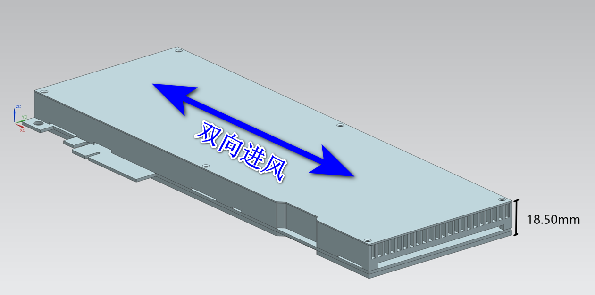

# CEN100 向量计算加速卡介绍


## 更新说明
| 版本号 | 说明 | 更新日期 |
|------|------|------|
| **V1.0** | 初始版本 | 20250521 |
| **V1.1** | 更新规格 | 20250821 |
| **V1.2** | 更新散热规格，更新文档描述 | 20250918 |


## 概述

### 产品简介

CEN100向量计算加速卡是采用单槽被动散热的PCIe Gen3x8板卡，针对向量数据库场景做了专门的软硬件优化，相比传统CPU/GPU解决方案，提供了更高的性能，更低的延迟，更低的功耗以及更低的系统成本。适用于多种场景，比如推荐系统中的实时商品推荐和内容个性化推荐，比如搜索引擎中的语义搜索和图像检索，比如大模型中的RAG等。<br>


CEN100向量计算加速卡基于存算一体ReRAM芯片打造而成。ReRAM芯片作为核心器件，提供了强大的模拟计算能力，纳秒级完成128K向量距离计算，远远超越CPU和GPU的计算能力。模拟计算不仅计算速度快，而且功耗低，可以显著降低数据中心能耗。<br>


---


### 产品外观


### 外形尺寸


## 产品规格
### 基本规格

| 规格 | CEN100 |
|------|------|
| **功耗(W)** | 典型功耗：75<br>最大功耗：110 |
| **供电方式** | ATX |
| **通信接口** | PCIe Gen 3x8 |
| **散热方式** | 被动散热，需要机箱预留风扇 |
| **底库容量** | 卡上内存容量共8GB<br>底库向量个数由向量维度和总的内存容量共同决定 |
| **向量维度** | • 最大值：8,192<br>• 最小值：1<br>• 步进值：1 |
| **Topk** | • 最大值：16,384<br>• 最小值：1<br>• 步进值：1 |
| **Nlist** | • 最大值：262,144<br>• 最小值：1<br>• 步进值：1 |
| **Nprobe** | 范围：1 - Nlist |
> 说明
> - 典型功耗：常温环境下，通用数据集的测试功耗
> - 最大功耗：高温环境下，通用数据集的测试功耗


### 主要性能指标

| 规格 | CEN100 |
|------|------|
| **Cohere 100万数据集<br>256维** | QPS 17,000<br>Recall 95@10 |
| **SIFT 100万数据集<br>128维** | QPS 43,000<br>Recall 95@10 |
| **延迟(Latency)** | <10ms |


### 环境和可靠性规格

| 规格 | CEN100 |
|------|------|
| **工作温度（被动散热）** | 环境温度范围：-20℃ ~ 85℃<br>芯片结温范围：-20℃ ~ 105℃ |
| **储藏温度** | -40℃ ~ 75℃ |
| **工作湿度** | 5% ~ 85% 相对湿度 |
| **储藏湿度** | 5% ~ 95% 相对湿度 |

> 说明
> - 被动散热形态工作环境温度由系统散热设计决定，系统散热需保证向量计算加速卡工作在规定的温度范围


### 散热规格
#### 散热要求
CEN100向量计算加速卡选用被动散热方式（不带风扇），用于能够自主散热的系统环境，向量计算加速卡本身支持双向进/出风，如下图所示



#### 温度要求
向量计算加速卡内部有芯片结温监控点。在工作过程中，系统散热需保证芯片结温符合规格要求。为了保护芯片不受损坏，当达到高温时向量计算加速卡启动降频功能，此时板卡工作性能会降低。当到达极限温度时，向量计算加速卡启动热保护状态，板卡暂停工作，待温度降低之后仍然可以继续工作。

| 规格 | CEN100 |
|------|------|
| **向量计算加速卡自动降频** | 芯片结温超过 92℃ |
| **向量计算加速卡暂停使用** | 芯片结温超过 105℃ |
| **向量计算加速卡自动降频** | 环境温度超过 72℃ |
| **向量计算加速卡暂停使用** | 环境温度超过 85℃ |
> 说明
> - 芯片结温内部控制，无法通过SMI观测
> - 环境温度可以通过SMI观测 ```elem-smi -q -d temp -i 0```

### LED行为

| 规格 | CEN100 |
|------|------|
| **LED** | 1.红灯常亮，向量计算加速卡启动失败，需要通过软件重新升级固件<br>2.黄灯闪烁，PCIe未Linkup或者向量计算加速卡初始化未完成<br>3.绿灯常亮，向量计算加速卡初始化完成，等待通信<br>4.绿灯闪烁，Host和向量计算加速卡在通信<br>5.蓝灯闪烁，通过SMI发出Findme命令时，目标向量计算加速卡持续闪烁10秒。<br>&emsp;该功能用于在多个向量计算加速卡的机箱中查找目标加速卡。<br>6.红灯闪烁，向量计算加速卡的芯片结温超过极限，进入保护状态，暂停使用 |


---
## 部署建议

### 硬件要求
- **服务器**: 支持PCIe Gen3x8插槽
- **散热**: 机箱风扇，良好的空气流通。建议调整机箱内风扇转速，使环境温度小于72度。向量计算加速卡在环境温度超过72度时会自动降频以保护器件。
- **电源**: 确保充足的电源供应，至少150W 每卡。当向量计算加速卡工作压力较大时，功耗可以达到110W。

### 软件要求
- **操作系统**: Linux
- **驱动**: 安装ELE Driver
- **SDK**: 集成ELE SDK到应用程序


---

*本手册为CEN100向量数据库加速系统的技术文档，如有疑问请联系技术支持团队。*