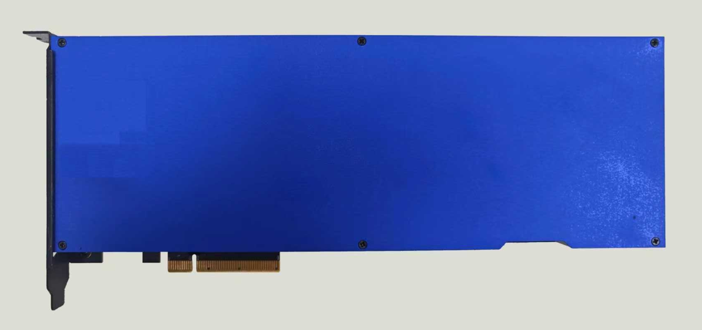

# 向量数据库加速系统产品介绍

## 产品介绍

### 功能及描述

VD2向量数据库加速系统基于忆元科技存算一体ReRAM芯片打造而成，针对向量数据库场景做了专门的软硬件优化，可以显著提升向量数据库的搜索性能，极大改善数据中心的能效比。

对比V1.0系统，V2.0系统在底库容量、板卡尺寸、功耗以及软件易用性方面都做了大范围升级，以满足用户多方面的需求。

全新的ReRAM芯片作为系统的核心器件，提供了强大的模拟计算能力，单颗芯片可在纳秒级完成最多128K个向量距离的计算，远远超越GPU和CPU的计算能力，非常适用于检索推荐系统，可以有效提升检索效率。

### 系统架构

VD向量数据库加速系统V2.0做了大幅度升级，每张加速卡包含8GB的内存。采用纯硬件的Search调度方法，简化了软件端的工作量，降低了对服务器性能的要求。

软件包含在服务器运行的ELE SDK和ELE PCIe Driver，以及在加速卡上运行的Card Firmware，加速卡的Firmware可以通过软件更新。

### 硬件板卡规格

| 项目 | 规格 |
|------|------|
| **型号** | VD2-8G |
| **板卡尺寸(mm)** | 265×100×23 (长×宽×高) 全高全长，1槽位 |
| **功耗(W)** | 90 |
| **供电方式** | ATX/自定义接口/PCIE金手指 |
| **通信接口** | PCIe Gen 3 x 8 |
| **散热方式** | 被动散热，需要机箱预留风扇 |

### 主要性能指标

| 项目 | 规格 |
|------|------|
| **型号** | VD2-8G |
| **Cohere 100万数据集 256维** | QPS 17,000 Recall 95@10 |
| **SIFT 100万数据集 128维** | QPS 43,000 Recall 95@10 |
| **延迟(Latency)** | <10ms |
| **底库容量** | 卡上内存容量共8GB 底库向量个数由向量维度和总的内存容量共同决定 |
| **向量维度** | • 最大值：8,192 • 最小值：1 • 步进值：1 |
| **Topk** | • 最大值：16,384 • 最小值：1 • 步进值：1 |
| **Nlist** | • 最大值：262,144 • 最小值：1 • 步进值：1 |
| **Nprobe** | 范围：1 - Nlist |

## 更新说明

| 版本号 | 说明 | 更新日期 |
|--------|------|----------|
| v1.0 | 初始版本 | 2025/05/21 |

---

## 产品特性

### 🚀 核心优势

- **超高性能**: 基于ReRAM存算一体芯片，纳秒级完成128K向量距离计算
- **低延迟**: 搜索延迟小于10ms
- **高吞吐**: SIFT数据集QPS可达43,000
- **大容量**: 单卡8GB内存，支持大规模向量存储
- **高精度**: Recall 95@10的高召回率
- **易部署**: 标准PCIe接口，支持多种供电方式

### 📊 性能对比

相比传统GPU/CPU解决方案：
- **计算速度**: 纳秒级 vs 毫秒级
- **功耗效率**: 显著降低数据中心能耗
- **并发能力**: 硬件级并行处理
- **成本效益**: 更高的性价比

### 🔧 技术规格详情

#### 内存配置
- **总容量**: 8GB DDR
- **带宽**: 高速内存访问
- **分配**: 灵活的向量存储分配

#### 接口规格
- **PCIe**: Gen 3 x 8 接口
- **带宽**: 理论带宽 ~8 GB/s
- **兼容性**: 标准PCIe插槽

#### 软件组件
- **ELE SDK**: 应用程序接口
- **PCIe Driver**: 硬件驱动程序
- **Card Firmware**: 板卡固件（可更新）

### 📈 应用场景

#### 推荐系统
- 实时商品推荐
- 内容个性化推荐
- 用户行为分析

#### 搜索引擎
- 语义搜索
- 图像检索
- 文档相似性匹配

#### AI应用
- 向量数据库加速
- 机器学习推理
- 自然语言处理

### 💡 部署建议

#### 硬件要求
- **服务器**: 支持PCIe Gen 3 x 8插槽
- **散热**: 机箱风扇，良好的空气流通
- **电源**: 确保充足的电源供应(90W per卡)

#### 软件要求
- **操作系统**: Linux (推荐)
- **驱动**: 安装对应的PCIe驱动
- **SDK**: 集成ELE SDK到应用程序

---

*本手册为VD2向量数据库加速系统的技术文档，如有疑问请联系技术支持团队。*